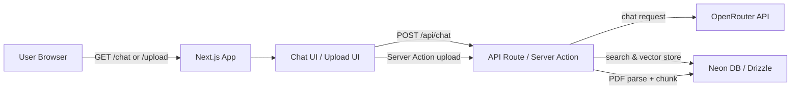
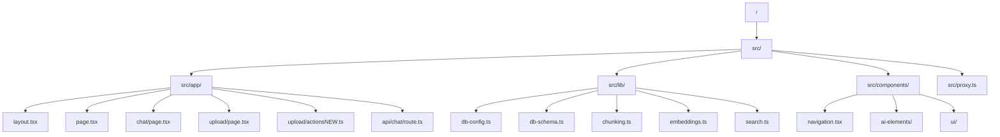

# aisdk-rag-chatbot

A Next.js App Router project that implements a simple Retrieval-Augmented Generation (RAG) chatbot with PDF upload, vector storage, and OpenRouter-powered chat.

## What this project contains

- A **chat UI** at `/chat` built using `@ai-sdk/react` and custom UI components.
- A **PDF upload page** at `/upload` that extracts text, chunks it, creates embeddings, and stores vectors in a Neon/Drizzle database.
- A **chat API route** at `/api/chat` that streams AI responses and uses a local vector search tool for knowledge retrieval.
- A **Clerk sign-in/out flow** via `@clerk/nextjs`.
- `biome` formatting and linting.

## Architecture overview



## Step-by-step usage

1. Clone the repository.
2. Install dependencies.
3. Create a `.env.local` file with the required API keys.
4. Start the app in development mode.
5. Upload a PDF at `/upload`.
6. Ask questions at `/chat` and the model will search the knowledge base.

## Required environment variables

Create `.env.local` in the project root and set:

```bash
OPENROUTER_API_KEY=your_openrouter_api_key
NEON_DATABASE_URL=your_neon_database_connection_string
```

> Optional: Clerk variables are required if you want the sign-in/signup flow to work. If Clerk is not configured, the UI still loads, but auth will not function.

## Commands

### `npm install`
Installs project dependencies from `package.json`.

### `npm run dev`
Starts the Next.js development server.

Implementation:
- uses `next dev`
- loads the App Router and enables hot reloading.

Usage:
```bash
npm run dev
```

### `npm run build`
Builds the production Next.js app.

Implementation:
- uses `next build`
- compiles TypeScript, bundles the app, and prepares it for `next start`.

Usage:
```bash
npm run build
```

### `npm run start`
Starts the production server after build.

Implementation:
- uses `next start`
- serves compiled output from `.next`.

Usage:
```bash
npm run start
```

### `npm run lint`
Runs `biome check` on the code.

Implementation:
- uses `biome` as the linting tool.
- validates syntax and TypeScript rules.

Usage:
```bash
npm run lint
```

### `npm run format`
Formats the code using `biome format --write`.

Implementation:
- uses `biome` formatting rules.
- rewrites files in place.

Usage:
```bash
npm run format
```

## Folder structure



## Project setup and workflow

### 1. Clone and install

```bash
git clone <repo-url>
cd aisdk-rag-chatbot
npm install
```

`npm install` installs all runtime and developer packages defined in `package.json`.

### 2. Configure environment variables

Create a `.env.local` file with:

```bash
OPENROUTER_API_KEY=your_openrouter_api_key
NEON_DATABASE_URL=your_neon_database_connection_string
```

These variables are required by the database connection and OpenRouter embedding/chat integration.

### 3. Start development

```bash
npm run dev
```

- This starts the Next.js development server.
- It enables hot reload for UI and backend code.

### 4. Build production assets

```bash
npm run build
```

- Compiles TypeScript.
- Bundles the app.
- Prepares server assets.

### 5. Run production server

```bash
npm run start
```

- Serves the compiled application from `.next`.

## Command details

### `npm install`

- Installs all dependencies and devDependencies needed for development and runtime.
- Required before running the application or compiling.

### `npm run dev`

- Runs `next dev`.
- Starts the app in development mode with hot reloading.

### `npm run build`

- Runs `next build`.
- Compiles all pages, server actions, and components into production-ready code.

### `npm run start`

- Runs `next start`.
- Launches the production server after `npm run build`.

### `npm run lint`

- Runs `biome check`.
- Detects syntax errors, type issues, and formatting problems.

### `npm run format`

- Runs `biome format --write`.
- Formats the repository according to Biome rules.

## Package documentation

### Core packages

- `next` — main framework for the application.
- `react`, `react-dom` — front-end UI library.
- `typescript` — static typing and compilation.
- `@ai-sdk/react` — chat hook integration for the client.
- `@ai-sdk/openai` — OpenAI/OpenRouter SDK for model and embedding calls.
- `ai` — AI runtime utilities for streaming and embeddings.
- `@openrouter/sdk` — supports OpenRouter API access.

### Authentication and auth routing

- `@clerk/nextjs` — provides Clerk authentication for sign-in, sign-out, and session protection.

### PDF and text processing

- `pdf-parse` — parse PDF files in server-side code.
- `@langchain/textsplitters` — split extracted text into smaller chunks for embeddings.
- `zod` — schema validation for tool inputs.

### Database and vector search

- `@neondatabase/serverless` — Neon database client.
- `drizzle-orm` — ORM used for schema and queries.
- `drizzle-kit` — Drizzle database tooling.

### UI and styling

- `tailwindcss` — utility CSS framework.
- `@tailwindcss/postcss` — Tailwind PostCSS plugin.
- `clsx` — conditional class names.
- `tailwind-merge` — merge Tailwind class strings.
- `class-variance-authority` — handle variant-based class sets.
- `lucide-react` — icon library used across UI components.
- `streamdown` and `@streamdown/*` — render streaming AI output.
- `use-stick-to-bottom` — keeps the chat scrolled to the newest message.
- `nanoid` — generate unique IDs for attachments.

### Optional UI / helper packages

These packages are included for UI support and may be used by generated or shared components:
- `@radix-ui/react-use-controllable-state`
- `@rive-app/react-webgl2`
- `@xyflow/react`
- `ansi-to-react`
- `cmdk`
- `embla-carousel-react`
- `input-otp`
- `media-chrome`
- `motion`
- `next-themes`
- `react-day-picker`
- `react-hook-form`
- `react-jsx-parser`
- `react-resizable-panels`
- `react-syntax-highlighter`
- `recharts`
- `shadcn`
- `shiki`
- `sonner`
- `tokenlens`
- `tw-animate-css`
- `vaul`

## How the app works

1. Upload a PDF at `/upload`.
2. Server action parses text, chunks it, generates embeddings, and stores them.
3. Use `/chat` to ask questions.
4. Chat API searches stored embeddings and calls OpenRouter.
5. Streamed responses return to the UI.

## Full source code used by the application

Below is the complete code for each custom file in the repository.

---

## `package.json`

```json
{
  "name": "aisdk-rag-chatbot",
  "version": "0.1.0",
  "private": true,
  "scripts": {
    "dev": "next dev",
    "build": "next build",
    "start": "next start",
    "lint": "biome check",
    "format": "biome format --write"
  },
  "dependencies": {
    "@ai-sdk/react": "^3.0.193",
    "@clerk/nextjs": "^7.4.2",
    "@langchain/textsplitters": "^1.0.1",
    "@neondatabase/serverless": "^1.1.0",
    "@radix-ui/react-use-controllable-state": "^1.2.2",
    "@rive-app/react-webgl2": "^4.28.6",
    "@streamdown/cjk": "^1.0.3",
    "@streamdown/code": "^1.1.1",
    "@streamdown/math": "^1.0.2",
    "@streamdown/mermaid": "^1.0.2",
    "@types/pdf-parse": "^1.1.5",
    "@xyflow/react": "^12.10.2",
    "ansi-to-react": "^6.2.6",
    "class-variance-authority": "^0.7.1",
    "clsx": "^2.1.1",
    "cmdk": "^1.1.1",
    "dotenv": "^17.4.2",
    "drizzle-orm": "^0.45.2",
    "embla-carousel-react": "^8.6.0",
    "input-otp": "^1.4.2",
    "lucide-react": "^1.16.0",
    "media-chrome": "^4.19.0",
    "motion": "^12.40.0",
    "nanoid": "^5.1.11",
    "next": "16.2.6",
    "next-themes": "^0.4.6",
    "pdf-parse": "^2.4.5",
    "radix-ui": "^1.4.3",
    "react": "19.2.4",
    "react-day-picker": "^10.0.1",
    "react-dom": "19.2.4",
    "react-hook-form": "^7.76.1",
    "react-jsx-parser": "^2.4.1",
    "react-resizable-panels": "^4.11.2",
    "react-syntax-highlighter": "^16.1.1",
    "recharts": "^3.8.1",
    "shadcn": "^4.8.0",
    "shiki": "^4.1.0",
    "sonner": "^2.0.7",
    "streamdown": "^2.5.0",
    "tailwind-merge": "^3.6.0",
    "tokenlens": "^1.3.1",
    "tw-animate-css": "^1.4.0",
    "use-stick-to-bottom": "^1.1.4",
    "vaul": "^1.1.2",
    "zod": "^4.4.3"
  },
  "devDependencies": {
    "@ai-sdk/openai": "^3.0.67",
    "@biomejs/biome": "2.2.0",
    "@openrouter/sdk": "^0.12.79",
    "@tailwindcss/postcss": "^4",
    "@types/node": "^20",
    "@types/react": "^19",
    "@types/react-dom": "^19",
    "@types/react-syntax-highlighter": "^15.5.13",
    "ai": "^6.0.194",
    "babel-plugin-react-compiler": "1.0.0",
    "drizzle-kit": "^0.31.10",
    "tailwindcss": "^4",
    "typescript": "^5"
  }
}
```

### `next.config.ts`

```ts
import type { NextConfig } from "next";

const nextConfig: NextConfig = {
  experimental: {
    serverActions: {
      bodySizeLimit: "10mb",
    },
  },
  serverExternalPackages: ["pdf-parse"],
  reactCompiler: true,
};

export default nextConfig;
```

### `tsconfig.json`

```json
{
  "compilerOptions": {
    "target": "ES2017",
    "lib": ["dom", "dom.iterable", "esnext"],
    "allowJs": true,
    "skipLibCheck": true,
    "strict": true,
    "noEmit": true,
    "esModuleInterop": true,
    "module": "esnext",
    "moduleResolution": "bundler",
    "resolveJsonModule": true,
    "isolatedModules": true,
    "jsx": "react-jsx",
    "incremental": true,
    "plugins": [
      {
        "name": "next"
      }
    ],
    "paths": {
      "@/*": ["./src/*"]
    }
  },
  "include": [
    "next-env.d.ts",
    "**/*.ts",
    "**/*.tsx",
    ".next/types/**/*.ts",
    ".next/dev/types/**/*.ts",
    "**/*.mts"
  ],
  "exclude": ["node_modules"]
}
```

---

## App entry points

### `src/app/layout.tsx`

```tsx
import type { Metadata } from "next";
import { Geist, Geist_Mono } from "next/font/google";
import "./globals.css";
import { ClerkProvider } from "@clerk/nextjs";
import { Navigation } from "@/components/navigation";

const geistSans = Geist({
  variable: "--font-geist-sans",
  subsets: ["latin"],
});

const geistMono = Geist_Mono({
  variable: "--font-geist-mono",
  subsets: ["latin"],
});

export const metadata: Metadata = {
  title: "Create Next App",
  description: "Generated by create next app",
};

export default function RootLayout({
  children,
}: Readonly<{
  children: React.ReactNode;
}>) {
  return (
    <ClerkProvider>
      <html
        lang="en"
        suppressHydrationWarning
        className={`${geistSans.variable} ${geistMono.variable} h-full antialiased`}
      >
        <body className="min-h-full flex flex-col">
          <Navigation />
          {children}
        </body>
      </html>
    </ClerkProvider>
  );
}
```

Explanation:
- Wraps the app in `ClerkProvider` for authentication.
- Adds global fonts and renders navigation on every page.

### `src/app/page.tsx`

```tsx
import Image from "next/image";

export default function Home() {
  return (
    <div className="flex flex-col flex-1 items-center justify-center bg-zinc-50 font-sans dark:bg-black">
      <main className="flex flex-1 w-full max-w-3xl flex-col items-center justify-between py-32 px-16 bg-white dark:bg-black sm:items-start">
        <Image
          className="dark:invert"
          src="/next.svg"
          alt="Next.js logo"
          width={100}
          height={20}
          priority
        />
        <div className="flex flex-col items-center gap-6 text-center sm:items-start sm:text-left">
          <h1 className="max-w-xs text-3xl font-semibold leading-10 tracking-tight text-black dark:text-zinc-50">
            To get started, edit the page.tsx file.
          </h1>
          <p className="max-w-md text-lg leading-8 text-zinc-600 dark:text-zinc-400">
            Looking for a starting point or more instructions? Head over to{" "}
            <a
              href="https://vercel.com/templates?framework=next.js&utm_source=create-next-app&utm_medium=appdir-template-tw&utm_campaign=create-next-app"
              className="font-medium text-zinc-950 dark:text-zinc-50"
            >
              Templates
            </a>{" "}
            or the{" "}
            <a
              href="https://nextjs.org/learn?utm_source=create-next-app&utm_medium=appdir-template-tw&utm_campaign=create-next-app"
              className="font-medium text-zinc-950 dark:text-zinc-50"
            >
              Learning
            </a>{" "}
            center.
          </p>
        </div>
        <div className="flex flex-col gap-4 text-base font-medium sm:flex-row">
          <a
            className="flex h-12 w-full items-center justify-center gap-2 rounded-full bg-foreground px-5 text-background transition-colors hover:bg-[#383838] dark:hover:bg-[#ccc] md:w-[158px]"
            href="https://vercel.com/new?utm_source=create-next-app&utm_medium=appdir-template-tw&utm_campaign=create-next-app"
            target="_blank"
            rel="noopener noreferrer"
          >
            <Image
              className="dark:invert"
              src="/vercel.svg"
              alt="Vercel logomark"
              width={16}
              height={16}
            />
            Deploy Now
          </a>
          <a
            className="flex h-12 w-full items-center justify-center rounded-full border border-solid border-black/[.08] px-5 transition-colors hover:border-transparent hover:bg-black/[.04] dark:border-white/[.145] dark:hover:bg-[#1a1a1a] md:w-[158px]"
            href="https://nextjs.org/docs?utm_source=create-next-app&utm_medium=appdir-template-tw&utm_campaign=create-next-app"
            target="_blank"
            rel="noopener noreferrer"
          >
            Documentation
          </a>
        </div>
      </main>
    </div>
  );
}
```

Explanation:
- Default home page scaffold created by Next.js.
- The actual application UI is located in `/chat` and `/upload`.

### `src/app/chat/page.tsx`

```tsx
"use client";
import { Fragment, useState } from "react";
import { useChat } from "@ai-sdk/react";
import {
  Conversation,
  ConversationContent,
  ConversationScrollButton,
} from "@/components/ai-elements/conversation";
import { Message, MessageContent } from "@/components/ai-elements/message";
import {
  PromptInput,
  PromptInputBody,
  type PromptInputMessage,
  PromptInputSubmit,
  PromptInputTextarea,
  PromptInputToolbar,
  PromptInputTools,
} from "@/components/ai-elements/prompt-input";
import { Response } from "@/components/ai-elements/response";
import { Loader } from "@/components/ai-elements/loader";

export default function RAGChatBot() {
  const [input, setInput] = useState("");
  const { messages, sendMessage, status } = useChat();

  const handleSubmit = (message: PromptInputMessage) => {
    if(!message.text) return;
    sendMessage({text:message.text});
    setInput("");
  }

  return (
    <div className="max-w-4xl mx-auto p-6 relative size-full h-[calc(100vh-4rem)]">
      <div className="flex flex-col h-full">
        <Conversation className="h-full">
          <ConversationContent>
            {messages.map((message) => (
              <div key={message.id}>
                {message.parts.map((part, i) => {
                  switch (part.type) {
                    case "text":
                      return (
                        <Fragment key={`${message.id}-${i}`}>
                          <Message from={message.role}>
                            <MessageContent>
                              <Response>{part.text}</Response>
                            </MessageContent>
                          </Message>
                        </Fragment>
                      );
                    default:
                      return null;
                  }
                })}
              </div>
            ))}
            {(status === "submitted" || status === "streaming") && <Loader />}
          </ConversationContent>
          <ConversationScrollButton />
        </Conversation>

        <PromptInput
          className="mt-4"
          onSubmit={handleSubmit}
        >
          <PromptInputBody>
            <PromptInputTextarea
              value={input}
              onChange={(e) => setInput(e.target.value)}
            />
          </PromptInputBody>
          <PromptInputToolbar>
            <PromptInputTools>
              {/* Model selector, web search etc */}
            </PromptInputTools>
            <PromptInputSubmit />
          </PromptInputToolbar>
        </PromptInput>
      </div>
    </div>
  );
}
```

Explanation:
- Uses `useChat()` from `@ai-sdk/react`.
- Renders chat messages, streaming loader, and prompt input.
- Messages are streamed from `/api/chat` via the AI SDK.

### `src/app/upload/page.tsx`

```tsx
"use client";

import { Loader2 } from "lucide-react";
import { useState } from "react";
import { Alert, AlertDescription, AlertTitle } from "@/components/ui/alert";
import { Card, CardContent } from "@/components/ui/card";
import { Input } from "@/components/ui/input";
import { Label } from "@/components/ui/label";
import { processPdfFile } from "./actionsNEW";

const MAX_UPLOAD_SIZE = 10 * 1024 * 1024;

export default function PDFUpload() {
  const [isLoading, setIsLoading] = useState(false);
  const [message, setMessage] = useState<{
    type: "error" | "success";
    text: string;
  } | null>(null);

  const handleFileUpload = async (e: React.ChangeEvent<HTMLInputElement>) => {
    const file = e.target.files?.[0];
    if (!file) return;

    if (file.type !== "application/pdf") {
      setMessage({ type: "error", text: "Only PDF files are supported" });
      e.target.value = "";
      return;
    }

    if (file.size > MAX_UPLOAD_SIZE) {
      setMessage({
        type: "error",
        text: "PDF must be 10 MB or smaller",
      });
      e.target.value = "";
      return;
    }

    setIsLoading(true);
    setMessage(null);

    try {
      const formData = new FormData();
      formData.append("pdf", file);

      const result = await processPdfFile(formData);

      if (result.success) {
        setMessage({
          type: "success",
          text: result.message || "PDF processed successfully",
        });
        e.target.value = "";
      } else {
        setMessage({
          type: "error",
          text: result.error || "Failed to process PDF",
        });
      }
    } catch {
      setMessage({
        type: "error",
        text: "An error occurred while processing the PDF",
      });
    } finally {
      setIsLoading(false);
    }
  };

  return (
    <div className="min-h-screen bg-gray-50 py-12 px-4">
      <div className="max-w-4xl mx-auto">
        <h1 className="text-3xl font-bold text-gray-900 mb-8 text-center">
          PDF Upload
        </h1>
        <Card className="mb-6">
          <CardContent className="pt-6">
            <div className="space-y-4">
              <div>
                <Label htmlFor="pdf-upload">Upload PDF File</Label>
                <Input
                  id="pdf-upload"
                  type="file"
                  accept=".pdf"
                  onChange={handleFileUpload}
                  disabled={isLoading}
                  className="mt-2"
                />
              </div>

              {isLoading && (
                <div className="flex items-center gap-2">
                  <Loader2 className="h-5 w-5 animate-spin" />
                  <span className="text-muted-foreground">
                    Processing PDF...
                  </span>
                </div>
              )}

              {message && (
                <Alert
                  variant={message.type === "error" ? "destructive" : "default"}
                >
                  <AlertTitle>
                    {message.type === "error" ? "Error!" : "Success!"}
                  </AlertTitle>
                  <AlertDescription>{message.text}</AlertDescription>
                </Alert>
              )}
            </div>
          </CardContent>
        </Card>
      </div>
    </div>
  );
}
```

Explanation:
- Accepts a PDF file.
- Validates file type and size.
- Sends the file to `processPdfFile` server action.
- Displays success or error feedback.

### `src/app/upload/actionsNEW.ts`

```ts
"use server";

import { PDFParse } from "pdf-parse";
import { chunkContent } from "@/lib/chunking";
import { db } from "@/lib/db-config";
import { documents } from "@/lib/db-schema";
import { generateEmbeddings } from "@/lib/embeddings";

export async function processPdfFile(formData: FormData) {
  try {
    const file = formData.get("pdf");

    if (!(file instanceof File) || file.size === 0) {
      return { success: false, error: "Please choose a PDF file to upload" };
    }

    if (file.type !== "application/pdf") {
      return { success: false, error: "Only PDF files are supported" };
    }

    if (!process.env.OPENROUTER_API_KEY) {
      return {
        success: false,
        error: "Missing OPENROUTER_API_KEY in .env.local for PDF embeddings",
      };
    }

    const bytes = await file.arrayBuffer();
    const parser = new PDFParse({ data: new Uint8Array(bytes) });
    const data = await parser.getText().finally(() => parser.destroy());

    if (!data.text || data?.text?.trim()?.length === 0) {
      return { success: false, error: "No text found in PDF file" };
    }

    const chunks = await chunkContent(data.text);
    const embeddings = await generateEmbeddings(chunks);
    const records = chunks.map((chunk, index) => ({
      content: chunk,
      embedding: embeddings[index],
    }));

    await db.insert(documents).values(records);

    return {
      success: true,
      message: `Created ${records.length} searchable chunks`,
    };
  } catch (error) {
    console.error("PDF processing error", error);
    return { success: false, error: "Failed to process PDF file" };
  }
}
```

Explanation:
- Runs on the server using Next.js server actions.
- Parses PDF bytes into text.
- Chunks extracted text.
- Generates OpenRouter embeddings.
- Stores the vectors in Neon via Drizzle.

---

## Backend and search code

### `src/app/api/chat/route.ts`

```ts
import { streamText, UIMessage, convertToModelMessages, tool, InferUITools, UIDataTypes, stepCountIs } from "ai";
import { createOpenAI } from "@ai-sdk/openai";
import { z } from "zod";
import { searchDocuments } from "@/lib/search";

const openrouter = createOpenAI({
  apiKey: process.env.OPENROUTER_API_KEY!,
  baseURL: "https://openrouter.ai/api/v1",
});

const tools = {
  searchKnowledgeBase: tool({
    description: "Search the knowledge base for relevant information",
    inputSchema: z.object({
      query: z.string().describe("The search query to find relevant documents"),
    }),
    execute: async ({ query }) => {
      try {
        const results = await searchDocuments(query, 3, 0.5);

        if (results.length === 0) {
          return "No relevant information found in the knowledge base.";
        }

        const formattedResults = results
          .map((r, i) => `[${i + 1}] ${r.content}`)
          .join("\n\n");

        return formattedResults;
      } catch (error) {
        console.error("Search error:", error);
        return "Error searching the knowledge base.";
      }
    },
  }),
};

export type ChatTools = InferUITools<typeof tools>;
export type ChatMessage = UIMessage<never, UIDataTypes, ChatTools>;

export async function POST(req: Request) {
  try {
    const { messages }: { messages: ChatMessage[] } = await req.json();
    const modelMessages = await convertToModelMessages(messages);

    const result = streamText({
      model: openrouter("openai/gpt-oss-120b:free"),
      messages: modelMessages,
      tools,
      system: `You are a helpful assistant with access to a knowledge base. 
          When users ask questions, search the knowledge base for relevant information.
          Always search before answering if the question might relate to uploaded documents.
          Base your answers on the search results when available. Give concise answers that correctly answer what the user is asking for. Do not flood them with all the information from the search results.`,
      stopWhen: stepCountIs(2),
    });

    return result.toUIMessageStreamResponse();
  } catch (error) {
    console.error("Error streaming chat completion:", error);

    return new Response("Failed to stream chat completion", { status: 500 });
  }
}
```

Explanation:
- Converts UI messages to model messages.
- Uses OpenRouter's GPT model.
- Adds a tool named `searchKnowledgeBase`.
- Streams responses back to the client.
- Searches the local database for relevant uploaded document chunks when necessary.

### `src/lib/db-config.ts`

```ts
import { drizzle } from "drizzle-orm/neon-http";
import { neon } from "@neondatabase/serverless";
import { config } from "dotenv";

config({path: ".env.local"});
const sql = neon(process.env.NEON_DATABASE_URL!);
export const db = drizzle(sql);
```

Explanation:
- Loads database credentials from `.env.local`.
- Creates a Neon database client.
- Exposes `db` for queries and inserts.

### `src/lib/db-schema.ts`

```ts
import { pgTable, serial, text, vector, index } from "drizzle-orm/pg-core";

export const documents = pgTable(
  "documents",
  {
    id: serial("id").primaryKey(),
    content: text("content").notNull(),
    embedding: vector("embedding", { dimensions: 1536 }),
  },
  (table) => [
    index("embeddingIndex").using(
      "hnsw",
      table.embedding.op("vector_cosine_ops")
    ),
  ]
);

export type InsertDocument = typeof documents.$inferInsert;
export type SelectDocument = typeof documents.$inferSelect;
```

Explanation:
- Defines the `documents` table.
- Stores text chunks and 1536-dimensional embeddings.
- Creates a cosine similarity index for vector search.

### `src/lib/chunking.ts`

```ts
import { RecursiveCharacterTextSplitter } from "@langchain/textsplitters";

export const textSplitter = new RecursiveCharacterTextSplitter({
  chunkSize: 150,
  chunkOverlap: 20,
  separators: [" "],
});

export async function chunkContent(content: string) {
  return await textSplitter.splitText(content.trim());
}
```

Explanation:
- Splits long PDF text into overlapping chunks.
- Provides smaller pieces that are suitable for embedding.

### `src/lib/embeddings.ts`

```ts
import { createOpenAI } from "@ai-sdk/openai";
import { embed, embedMany } from "ai";

const openrouter = createOpenAI({
  apiKey: process.env.OPENROUTER_API_KEY,
  baseURL: "https://openrouter.ai/api/v1",
});

const embeddingModel = openrouter.textEmbeddingModel(
  "openai/text-embedding-3-small",
);

export async function generateEmbedding(text: string): Promise<number[]> {
  const input = text.replaceAll("\n", " ");

  const { embedding } = await embed({
    model: embeddingModel,
    value: input,
  });

  return embedding;
}

export async function generateEmbeddings(texts: string[]): Promise<number[][]> {
  const inputs = texts.map((text) => text.replaceAll("\n", " "));

  const { embeddings } = await embedMany({
    model: embeddingModel,
    values: inputs,
  });

  return embeddings;
}
```

Explanation:
- Uses OpenRouter text-embedding model for vector generation.
- Supports single or batch embedding generation.

### `src/lib/search.ts`

```ts
import { cosineDistance, desc, gt, sql } from "drizzle-orm";
import { db } from "./db-config";
import { documents } from "./db-schema";
import { generateEmbedding } from "./embeddings";

export async function searchDocuments(
  query: string,
  limit: number = 5,
  threshold: number = 0.5
) {
  const embedding = await generateEmbedding(query);

  const similarity = sql<number>`1 - (${cosineDistance(
    documents.embedding,
    embedding
  )})`;

  const similarDocuments = await db
    .select({
      id: documents.id,
      content: documents.content,
      similarity,
    })
    .from(documents)
    .where(gt(similarity, threshold))
    .orderBy(desc(similarity))
    .limit(limit);

  return similarDocuments;
}
```

Explanation:
- Converts user query to a vector.
- Performs similarity search in the `documents` table.
- Returns top matching chunks.

### `src/lib/utils.ts`

```ts
import { clsx, type ClassValue } from "clsx"
import { twMerge } from "tailwind-merge"

export function cn(...inputs: ClassValue[]) {
  return twMerge(clsx(inputs))
}
```

Explanation:
- Small utility for composing Tailwind class names.
- Used by UI components throughout the project.

---

## UI components

### `src/components/navigation.tsx`

```tsx
"use client";

import {
  SignInButton,
  SignOutButton,
  SignUpButton,
  useUser,
} from "@clerk/nextjs";
import { Button } from "@/components/ui/button";

export const Navigation = () => {
  const { isSignedIn } = useUser();

  return (
    <nav className="border-b border-(--foreground)/10">
      <div className="flex container h-16 items-center justify-between px-4  mx-auto">
        <div className="text-xl font-semibold">RAG Chatbot</div>

        <div className="flex gap-2">
          {isSignedIn ? (
            <SignOutButton>
              <Button className="cursor-pointer" variant="outline">Sign Out</Button>
            </SignOutButton>
          ) : (
            <>
              <SignInButton mode="modal">
                <Button variant="ghost" className="cursor-pointer">Sign In</Button>
              </SignInButton>
              <SignUpButton mode="modal">
                <Button className="cursor-pointer">Sign Up</Button>
              </SignUpButton>
            </>
          )}
        </div>
      </div>
    </nav>
  );
};
```

Explanation:
- Adds authentication controls in the header.
- Uses Clerk buttons for sign-in and sign-out.

### `src/components/ai-elements/conversation.tsx`

```tsx
"use client";

import { Button } from "@/components/ui/button";
import { cn } from "@/lib/utils";
import { ArrowDownIcon } from "lucide-react";
import type { ComponentProps } from "react";
import { useCallback } from "react";
import { StickToBottom, useStickToBottomContext } from "use-stick-to-bottom";

export type ConversationProps = ComponentProps<typeof StickToBottom>;

export const Conversation = ({ className, ...props }: ConversationProps) => (
  <StickToBottom
    className={cn("relative flex-1 overflow-y-auto", className)}
    initial="smooth"
    resize="smooth"
    role="log"
    {...props}
  />
);

export type ConversationContentProps = ComponentProps<
  typeof StickToBottom.Content
>;

export const ConversationContent = ({
  className,
  ...props
}: ConversationContentProps) => (
  <StickToBottom.Content className={cn("p-4", className)} {...props} />
);

export type ConversationEmptyStateProps = ComponentProps<"div"> & {
  title?: string;
  description?: string;
  icon?: React.ReactNode;
};

export const ConversationEmptyState = ({
  className,
  title = "No messages yet",
  description = "Start a conversation to see messages here",
  icon,
  children,
  ...props
}: ConversationEmptyStateProps) => (
  <div
    className={cn(
      "flex size-full flex-col items-center justify-center gap-3 p-8 text-center",
      className
    )}
    {...props}
  >
    {children ?? (
      <>
        {icon && <div className="text-muted-foreground">{icon}</div>}
        <div className="space-y-1">
          <h3 className="font-medium text-sm">{title}</h3>
          {description && (
            <p className="text-muted-foreground text-sm">{description}</p>
          )}
        </div>
      </>
    )}
  </div>
);

export type ConversationScrollButtonProps = ComponentProps<typeof Button>;

export const ConversationScrollButton = ({
  className,
  ...props
}: ConversationScrollButtonProps) => {
  const { isAtBottom, scrollToBottom } = useStickToBottomContext();

  const handleScrollToBottom = useCallback(() => {
    scrollToBottom();
  }, [scrollToBottom]);

  return (
    !isAtBottom && (
      <Button
        className={cn(
          "absolute bottom-4 left-[50%] translate-x-[-50%] rounded-full",
          className
        )}
        onClick={handleScrollToBottom}
        size="icon"
        type="button"
        variant="outline"
        {...props}
      >
        <ArrowDownIcon className="size-4" />
      </Button>
    )
  );
};
```

Explanation:
- Wraps conversation content in a scrollable pane.
- Provides a button to jump to the latest message.

### `src/components/ai-elements/message.tsx`

```tsx
import {
  Avatar,
  AvatarFallback,
  AvatarImage,
} from "@/components/ui/avatar";
import { cn } from "@/lib/utils";
import type { UIMessage } from "ai";
import { cva, type VariantProps } from "class-variance-authority";
import type { ComponentProps, HTMLAttributes } from "react";

export type MessageProps = HTMLAttributes<HTMLDivElement> & {
  from: UIMessage["role"];
};

export const Message = ({ className, from, ...props }: MessageProps) => (
  <div
    className={cn(
      "group flex w-full items-end justify-end gap-2 py-4",
      from === "user" ? "is-user" : "is-assistant flex-row-reverse justify-end",
      className
    )}
    {...props}
  />
);

const messageContentVariants = cva(
  "is-user:dark flex flex-col gap-2 overflow-hidden rounded-lg text-sm",
  {
    variants: {
      variant: {
        contained: [
          "max-w-[80%] px-4 py-3",
          "group-[.is-user]:bg-primary group-[.is-user]:text-primary-foreground",
          "group-[.is-assistant]:bg-secondary group-[.is-assistant]:text-foreground",
        ],
        flat: [
          "group-[.is-user]:max-w-[80%] group-[.is-user]:bg-secondary group-[.is-user]:px-4 group-[.is-user]:py-3 group-[.is-user]:text-foreground",
          "group-[.is-assistant]:text-foreground",
        ],
      },
    },
    defaultVariants: {
      variant: "contained",
    },
  }
);

export type MessageContentProps = HTMLAttributes<HTMLDivElement> &
  VariantProps<typeof messageContentVariants>;

export const MessageContent = ({
  children,
  className,
  variant,
  ...props
}: MessageContentProps) => (
  <div
    className={cn(messageContentVariants({ variant, className }))}
    {...props}
  >
    {children}
  </div>
);

export type MessageAvatarProps = ComponentProps<typeof Avatar> & {
  src: string;
  name?: string;
};

export const MessageAvatar = ({
  src,
  name,
  className,
  ...props
}: MessageAvatarProps) => (
  <Avatar className={cn("size-8 ring-1 ring-border", className)} {...props}>
    <AvatarImage alt="" className="mt-0 mb-0" src={src} />
    <AvatarFallback>{name?.slice(0, 2) || "ME"}</AvatarFallback>
  </Avatar>
);
```

Explanation:
- Renders chat bubbles for user and assistant messages.
- Uses variants for styling.

### `src/components/ai-elements/prompt-input.tsx`

```tsx
"use client";

import { Button } from "@/components/ui/button";
import {
  DropdownMenu,
  DropdownMenuContent,
  DropdownMenuItem,
  DropdownMenuTrigger,
} from "@/components/ui/dropdown-menu";
import {
  Select,
  SelectContent,
  SelectItem,
  SelectTrigger,
  SelectValue,
} from "@/components/ui/select";
import { Textarea } from "@/components/ui/textarea";
import { cn } from "@/lib/utils";
import type { ChatStatus, FileUIPart } from "ai";
import {
  ImageIcon,
  Loader2Icon,
  PaperclipIcon,
  PlusIcon,
  SendIcon,
  SquareIcon,
  XIcon,
} from "lucide-react";
import { nanoid } from "nanoid";
import {
  type ChangeEventHandler,
  Children,
  type ComponentProps,
  createContext,
  type FormEvent,
  type FormEventHandler,
  Fragment,
  type HTMLAttributes,
  type KeyboardEventHandler,
  type RefObject,
  useCallback,
  useContext,
  useEffect,
  useLayoutEffect,
  useMemo,
  useRef,
  useState,
} from "react";

type AttachmentsContext = {
  files: (FileUIPart & { id: string })[];
  add: (files: File[] | FileList) => void;
  remove: (id: string) => void;
  clear: () => void;
  openFileDialog: () => void;
  fileInputRef: RefObject<HTMLInputElement | null>;
};

const AttachmentsContext = createContext<AttachmentsContext | null>(null);

export const usePromptInputAttachments = () => {
  const context = useContext(AttachmentsContext);

  if (!context) {
    throw new Error(
      "usePromptInputAttachments must be used within a PromptInput"
    );
  }

  return context;
};

export type PromptInputAttachmentProps = HTMLAttributes<HTMLDivElement> & {
  data: FileUIPart & { id: string };
  className?: string;
};

export function PromptInputAttachment({
  data,
  className,
  ...props
}: PromptInputAttachmentProps) {
  const attachments = usePromptInputAttachments();

  return (
    <div
      className={cn("group relative h-14 w-14 rounded-md border", className)}
      key={data.id}
      {...props}
    >
      {data.mediaType?.startsWith("image/") && data.url ? (
        
      ) : (
        <div className="flex size-full items-center justify-center text-muted-foreground">
          <PaperclipIcon className="size-4" />
        </div>
      )}
      <Button
        aria-label="Remove attachment"
        className="-right-1.5 -top-1.5 absolute h-6 w-6 rounded-full opacity-0 group-hover:opacity-100"
        onClick={() => attachments.remove(data.id)}
        size="icon"
        type="button"
        variant="outline"
      >
        <XIcon className="h-3 w-3" />
      </Button>
    </div>
  );
}

export type PromptInputAttachmentsProps = Omit<
  HTMLAttributes<HTMLDivElement>,
  "children"
> & {
  children: (attachment: FileUIPart & { id: string }) => React.ReactNode;
};

export function PromptInputAttachments({
  className,
  children,
  ...props
}: PromptInputAttachmentsProps) {
  const attachments = usePromptInputAttachments();
  const [height, setHeight] = useState(0);
  const contentRef = useRef<HTMLDivElement>(null);

  useLayoutEffect(() => {
    const el = contentRef.current;
    if (!el) {
      return;
    }
    const ro = new ResizeObserver(() => {
      setHeight(el.getBoundingClientRect().height);
    });
    ro.observe(el);
    setHeight(el.getBoundingClientRect().height);
    return () => ro.disconnect();
  }, []);

  return (
    <div
      aria-live="polite"
      className={cn(
        "overflow-hidden transition-[height] duration-200 ease-out",
        className
      )}
      style={{ height: attachments.files.length ? height : 0 }}
      {...props}
    >
      <div className="flex flex-wrap gap-2 p-3 pt-3" ref={contentRef}>
        {attachments.files.map((file) => (
          <Fragment key={file.id}>{children(file)}</Fragment>
        ))}
      </div>
    </div>
  );
}

export type PromptInputActionAddAttachmentsProps = ComponentProps<
  typeof DropdownMenuItem
> & {
  label?: string;
};

export const PromptInputActionAddAttachments = ({
  label = "Add photos or files",
  ...props
}: PromptInputActionAddAttachmentsProps) => {
  const attachments = usePromptInputAttachments();

  return (
    <DropdownMenuItem
      {...props}
      onSelect={(e) => {
        e.preventDefault();
        attachments.openFileDialog();
      }}
    >
      <ImageIcon className="mr-2 size-4" /> {label}
    </DropdownMenuItem>
  );
};

export type PromptInputMessage = {
  text?: string;
  files?: FileUIPart[];
};

export type PromptInputProps = Omit<
  HTMLAttributes<HTMLFormElement>,
  "onSubmit"
> & {
  accept?: string;
  multiple?: boolean;
  globalDrop?: boolean;
  syncHiddenInput?: boolean;
  maxFiles?: number;
  maxFileSize?: number;
  onError?: (err: {
    code: "max_files" | "max_file_size" | "accept";
    message: string;
  }) => void;
  onSubmit: (
    message: PromptInputMessage,
    event: FormEvent<HTMLFormElement>
  ) => void;
};

export const PromptInput = ({
  className,
  accept,
  multiple,
  globalDrop,
  syncHiddenInput,
  maxFiles,
  maxFileSize,
  onError,
  onSubmit,
  ...props
}: PromptInputProps) => {
  const [items, setItems] = useState<(FileUIPart & { id: string })[]>([]);
  const inputRef = useRef<HTMLInputElement | null>(null);
  const anchorRef = useRef<HTMLSpanElement>(null);
  const formRef = useRef<HTMLFormElement | null>(null);

  useEffect(() => {
    const root = anchorRef.current?.closest("form");
    if (root instanceof HTMLFormElement) {
      formRef.current = root;
    }
  }, []);

  const openFileDialog = useCallback(() => {
    inputRef.current?.click();
  }, []);

  const matchesAccept = useCallback(
    (f: File) => {
      if (!accept || accept.trim() === "") {
        return true;
      }
      if (accept.includes("image/*")) {
        return f.type.startsWith("image/");
      }
      return true;
    },
    [accept]
  );

  const add = useCallback(
    (files: File[] | FileList) => {
      const incoming = Array.from(files);
      const accepted = incoming.filter((f) => matchesAccept(f));
      if (accepted.length === 0) {
        onError?.({
          code: "accept",
          message: "No files match the accepted types.",
        });
        return;
      }
      const withinSize = (f: File) =>
        maxFileSize ? f.size <= maxFileSize : true;
      const sized = accepted.filter(withinSize);
      if (sized.length === 0 && accepted.length > 0) {
        onError?.({
          code: "max_file_size",
          message: "All files exceed the maximum size.",
        });
        return;
      }
      setItems((prev) => {
        const capacity =
          typeof maxFiles === "number"
            ? Math.max(0, maxFiles - prev.length)
            : undefined;
        const capped =
          typeof capacity === "number" ? sized.slice(0, capacity) : sized;
        if (typeof capacity === "number" && sized.length > capacity) {
          onError?.({
            code: "max_files",
            message: "Too many files. Some were not added.",
          });
        }
        const next: (FileUIPart & { id: string })[] = [];
        for (const file of capped) {
          next.push({
            id: nanoid(),
            type: "file",
            url: URL.createObjectURL(file),
            mediaType: file.type,
            filename: file.name,
          });
        }
        return prev.concat(next);
      });
    },
    [matchesAccept, maxFiles, maxFileSize, onError]
  );

  const remove = useCallback((id: string) => {
    setItems((prev) => {
      const found = prev.find((file) => file.id === id);
      if (found?.url) {
        URL.revokeObjectURL(found.url);
      }
      return prev.filter((file) => file.id !== id);
    });
  }, []);

  const clear = useCallback(() => {
    setItems((prev) => {
      for (const file of prev) {
        if (file.url) {
          URL.revokeObjectURL(file.url);
        }
      }
      return [];
    });
  }, []);

  useEffect(() => {
    if (syncHiddenInput && inputRef.current) {
      if (items.length === 0) {
        inputRef.current.value = "";
      }
    }
  }, [items, syncHiddenInput]);

  useEffect(() => {
    const form = formRef.current;
    if (!form) {
      return;
    }
    const onDragOver = (e: DragEvent) => {
      if (e.dataTransfer?.types?.includes("Files")) {
        e.preventDefault();
      }
    };
    const onDrop = (e: DragEvent) => {
      if (e.dataTransfer?.types?.includes("Files")) {
        e.preventDefault();
      }
      if (e.dataTransfer?.files && e.dataTransfer.files.length > 0) {
        add(e.dataTransfer.files);
      }
    };
    form.addEventListener("dragover", onDragOver);
    form.addEventListener("drop", onDrop);
    return () => {
      form.removeEventListener("dragover", onDragOver);
      form.removeEventListener("drop", onDrop);
    };
  }, [add]);

  useEffect(() => {
    if (!globalDrop) {
      return;
    }
    const onDragOver = (e: DragEvent) => {
      if (e.dataTransfer?.types?.includes("Files")) {
        e.preventDefault();
      }
    };
    const onDrop = (e: DragEvent) => {
      if (e.dataTransfer?.types?.includes("Files")) {
        e.preventDefault();
      }
      if (e.dataTransfer?.files && e.dataTransfer.files.length > 0) {
        add(e.dataTransfer.files);
      }
    };
    document.addEventListener("dragover", onDragOver);
    document.addEventListener("drop", onDrop);
    return () => {
      document.removeEventListener("dragover", onDragOver);
      document.removeEventListener("drop", onDrop);
    };
  }, [add, globalDrop]);

  const handleChange: ChangeEventHandler<HTMLInputElement> = (event) => {
    if (event.currentTarget.files) {
      add(event.currentTarget.files);
    }
  };

  const handleSubmit: FormEventHandler<HTMLFormElement> = (event) => {
    event.preventDefault();

    const files: FileUIPart[] = items.map(({ ...item }) => ({
      ...item,
    }));

    onSubmit({ text: event.currentTarget.message.value, files }, event);
  };

  const ctx = useMemo<AttachmentsContext>(
    () => ({
      files: items.map((item) => ({ ...item, id: item.id })),
      add,
      remove,
      clear,
      openFileDialog,
      fileInputRef: inputRef,
    }),
    [items, add, remove, clear, openFileDialog]
  );

  return (
    <AttachmentsContext.Provider value={ctx}>
      <span aria-hidden="true" className="hidden" ref={anchorRef} />
      <input
        accept={accept}
        className="hidden"
        multiple={multiple}
        onChange={handleChange}
        ref={inputRef}
        type="file"
      />
      <form
        className={cn(
          "w-full divide-y overflow-hidden rounded-xl border bg-background shadow-sm",
          className
        )}
        onSubmit={handleSubmit}
        {...props}
      />
    </AttachmentsContext.Provider>
  );
};

export type PromptInputBodyProps = HTMLAttributes<HTMLDivElement>;

export const PromptInputBody = ({
  className,
  ...props
}: PromptInputBodyProps) => (
  <div className={cn(className, "flex flex-col")} {...props} />
);

export type PromptInputTextareaProps = ComponentProps<typeof Textarea>;

export const PromptInputTextarea = ({
  onChange,
  className,
  placeholder = "What would you like to know?",
  ...props
}: PromptInputTextareaProps) => {
  const handleKeyDown: KeyboardEventHandler<HTMLTextAreaElement> = (e) => {
    if (e.key === "Enter") {
      if (e.nativeEvent.isComposing) {
        return;
      }
      if (e.shiftKey) {
        return;
      }
      e.preventDefault();
      const form = e.currentTarget.form;
      if (form) {
        form.requestSubmit();
      }
    }
  };

  return (
    <Textarea
      className={cn(
        "w-full resize-none rounded-none border-none p-3 shadow-none outline-none ring-0",
        "field-sizing-content bg-transparent dark:bg-transparent",
        "max-h-48 min-h-16",
        "focus-visible:ring-0",
        className
      )}
      name="message"
      onChange={(e) => {
        onChange?.(e);
      }}
      onKeyDown={handleKeyDown}
      placeholder={placeholder}
      {...props}
    />
  );
};

export type PromptInputToolbarProps = HTMLAttributes<HTMLDivElement>;

export const PromptInputToolbar = ({
  className,
  ...props
}: PromptInputToolbarProps) => (
  <div
    className={cn("flex items-center justify-between p-1", className)}
    {...props}
  />
);

export type PromptInputToolsProps = HTMLAttributes<HTMLDivElement>;

export const PromptInputTools = ({
  className,
  ...props
}: PromptInputToolsProps) => (
  <div
    className={cn(
      "flex items-center gap-1",
      "[&_button:first-child]:rounded-bl-xl",
      className
    )}
    {...props}
  />
);

export type PromptInputButtonProps = ComponentProps<typeof Button>;

export const PromptInputButton = ({
  variant = "ghost",
  className,
  size,
  ...props
}: PromptInputButtonProps) => {
  const newSize =
    (size ?? Children.count(props.children) > 1) ? "default" : "icon";

  return (
    <Button
      className={cn(
        "shrink-0 gap-1.5 rounded-lg",
        variant === "ghost" && "text-muted-foreground",
        newSize === "default" && "px-3",
        className
      )}
      size={newSize}
      type="button"
      variant={variant}
      {...props}
    />
  );
};

export type PromptInputActionMenuProps = ComponentProps<typeof DropdownMenu>;
export const PromptInputActionMenu = (props: PromptInputActionMenuProps) => (
  <DropdownMenu {...props} />
);

export type PromptInputActionMenuTriggerProps = ComponentProps<
  typeof Button
> & {};
export const PromptInputActionMenuTrigger = ({
  className,
  children,
  ...props
}: PromptInputActionMenuTriggerProps) => (
  <DropdownMenuTrigger asChild>
    <PromptInputButton className={className} {...props}>
      {children ?? <PlusIcon className="size-4" />}
    </PromptInputButton>
  </DropdownMenuTrigger>
);

export type PromptInputActionMenuContentProps = ComponentProps<
  typeof DropdownMenuContent
>;
export const PromptInputActionMenuContent = ({
  className,
  ...props
}: PromptInputActionMenuContentProps) => (
  <DropdownMenuContent align="start" className={cn(className)} {...props} />
);

export type PromptInputActionMenuItemProps = ComponentProps<
  typeof DropdownMenuItem
>;
export const PromptInputActionMenuItem = ({
  className,
  ...props
}: PromptInputActionMenuItemProps) => (
  <DropdownMenuItem className={cn(className)} {...props} />
);

export type PromptInputSubmitProps = ComponentProps<typeof Button> & {
  status?: ChatStatus;
};

export const PromptInputSubmit = ({
  className,
  variant = "default",
  size = "icon",
  status,
  children,
  ...props
}: PromptInputSubmitProps) => {
  let Icon = <SendIcon className="size-4" />;

  if (status === "submitted") {
    Icon = <Loader2Icon className="size-4 animate-spin" />;
  } else if (status === "streaming") {
    Icon = <SquareIcon className="size-4" />;
  } else if (status === "error") {
    Icon = <XIcon className="size-4" />;
  }

  return (
    <Button
      className={cn("gap-1.5 rounded-lg", className)}
      size={size}
      type="submit"
      variant={variant}
      {...props}
    >
      {children ?? Icon}
    </Button>
  );
};

export type PromptInputModelSelectProps = ComponentProps<typeof Select>;

export const PromptInputModelSelect = (props: PromptInputModelSelectProps) => (
  <Select {...props} />
);

export type PromptInputModelSelectTriggerProps = ComponentProps<
  typeof SelectTrigger
>;

export const PromptInputModelSelectTrigger = ({
  className,
  ...props
}: PromptInputModelSelectTriggerProps) => (
  <SelectTrigger
    className={cn(
      "border-none bg-transparent font-medium text-muted-foreground shadow-none transition-colors",
      'hover:bg-accent hover:text-foreground [&[aria-expanded="true"]]:bg-accent [&[aria-expanded="true"]]:text-foreground',
      className
    )}
    {...props}
  />
);

export type PromptInputModelSelectContentProps = ComponentProps<
  typeof SelectContent
>;

export const PromptInputModelSelectContent = ({
  className,
  ...props
}: PromptInputModelSelectContentProps) => (
  <SelectContent className={cn(className)} {...props} />
);

export type PromptInputModelSelectItemProps = ComponentProps<typeof SelectItem>;

export const PromptInputModelSelectItem = ({
  className,
  ...props
}: PromptInputModelSelectItemProps) => (
  <SelectItem className={cn(className)} {...props} />
);

export type PromptInputModelSelectValueProps = ComponentProps<
  typeof SelectValue
>;

export const PromptInputModelSelectValue = ({
  className,
  ...props
}: PromptInputModelSelectValueProps) => (
  <SelectValue className={cn(className)} {...props} />
);
```

Explanation:
- Provides a complete prompt input system.
- Handles file attachments, drag and drop, keyboard submission, and form state.
- Supports a submit button with streaming/loading state.

### `src/components/ai-elements/response.tsx`

```tsx
"use client";

import { cn } from "@/lib/utils";
import { type ComponentProps, memo } from "react";
import { Streamdown } from "streamdown";

type ResponseProps = ComponentProps<typeof Streamdown>;

export const Response = memo(
  ({ className, ...props }: ResponseProps) => (
    <Streamdown
      className={cn(
        "size-full [&>*:first-child]:mt-0 [&>*:last-child]:mb-0",
        className
      )}
      {...props}
    />
  ),
  (prevProps, nextProps) => prevProps.children === nextProps.children
);

Response.displayName = "Response";
```

Explanation:
- Renders streaming text output.
- Uses `Streamdown` to preserve line breaks and markup.

### `src/components/ai-elements/loader.tsx`

```tsx
import { cn } from "@/lib/utils";
import type { HTMLAttributes } from "react";

type LoaderIconProps = {
  size?: number;
};

const LoaderIcon = ({ size = 16 }: LoaderIconProps) => (
  <svg
    height={size}
    strokeLinejoin="round"
    style={{ color: "currentcolor" }}
    viewBox="0 0 16 16"
    width={size}
  >
    <title>Loader</title>
    <g clipPath="url(#clip0_2393_1490)">
      <path d="M8 0V4" stroke="currentColor" strokeWidth="1.5" />
      <path
        d="M8 16V12"
        opacity="0.5"
        stroke="currentColor"
        strokeWidth="1.5"
      />
      <path
        d="M3.29773 1.52783L5.64887 4.7639"
        opacity="0.9"
        stroke="currentColor"
        strokeWidth="1.5"
      />
      <path
        d="M12.7023 1.52783L10.3511 4.7639"
        opacity="0.1"
        stroke="currentColor"
        strokeWidth="1.5"
      />
      <path
        d="M12.7023 14.472L10.3511 11.236"
        opacity="0.4"
        stroke="currentColor"
        strokeWidth="1.5"
      />
      <path
        d="M3.29773 14.472L5.64887 11.236"
        opacity="0.6"
        stroke="currentColor"
        strokeWidth="1.5"
      />
      <path
        d="M15.6085 5.52783L11.8043 6.7639"
        opacity="0.2"
        stroke="currentColor"
        strokeWidth="1.5"
      />
      <path
        d="M0.391602 10.472L4.19583 9.23598"
        opacity="0.7"
        stroke="currentColor"
        strokeWidth="1.5"
      />
      <path
        d="M15.6085 10.4722L11.8043 9.2361"
        opacity="0.3"
        stroke="currentColor"
        strokeWidth="1.5"
      />
      <path
        d="M0.391602 5.52783L4.19583 6.7639"
        opacity="0.8"
        stroke="currentColor"
        strokeWidth="1.5"
      />
    </g>
    <defs>
      <clipPath id="clip0_2393_1490">
        <rect fill="white" height="16" width="16" />
      </clipPath>
    </defs>
  </svg>
);

export type LoaderProps = HTMLAttributes<HTMLDivElement> & {
  size?: number;
};

export const Loader = ({ className, size = 16, ...props }: LoaderProps) => (
  <div
    className={cn(
      "inline-flex animate-spin items-center justify-center",
      className
    )}
    {...props}
  >
    <LoaderIcon size={size} />
  </div>
);
```

Explanation:
- Simple custom spinner used during chat submission.

---

## Proxy and middleware note

### `src/proxy.ts`

```ts
import { clerkMiddleware, createRouteMatcher } from "@clerk/nextjs/server";
import { NextResponse } from "next/server";

const isPublicRoute = createRouteMatcher(["/", "/sign-in(.*)", "/sign-up(.*)"]);
const isAdminRoute = createRouteMatcher(["/upload"]);

export default clerkMiddleware(async (auth, req) => {
  const { sessionClaims } = await auth();
  const isAdmin = sessionClaims?.metadata?.role === "admin";
  if (isAdminRoute(req) && !isAdmin) {
    return NextResponse.redirect(new URL("/", req.url));
  }

  if (!isPublicRoute(req)) {
    await auth.protect();
  }
});

export const config = {
  matcher: [
    "/((?!_next|[^?]*\.(?:html?|css|js(?!on)|jpe?g|webp|png|gif|svg|ttf|woff2?|ico|csv|docx?|xlsx?|zip|webmanifest)).*)",
    "/(api|trpc)(.*)",
    "/__clerk/(.*)",
  ],
};
```

Important:
- This file exists in the repository.
- In Next.js, middleware is normally named `middleware.ts` at the project root.
- To activate this Clerk route protection, rename `src/proxy.ts` to `middleware.ts` or move it to the project root as `middleware.ts`.

---

## How the workflow connects

### Upload workflow

1. User visits `/upload`.
2. User selects a PDF.
3. `processPdfFile` reads PDF bytes using `pdf-parse`.
4. Text is split using `src/lib/chunking.ts`.
5. Vectors are generated using `src/lib/embeddings.ts`.
6. Records are inserted into Neon via `src/lib/db-config.ts` and `src/lib/db-schema.ts`.

### Chat workflow

1. User visits `/chat`.
2. User enters a question.
3. `useChat()` sends UI messages to `/api/chat`.
4. `src/app/api/chat/route.ts` converts messages and calls `streamText()`.
5. The model can invoke `searchKnowledgeBase`.
6. `searchKnowledgeBase` uses `src/lib/search.ts` to query the vector store.
7. The model returns a streamed answer to the client.

## Notes on usage

- The app is built with the App Router.
- `@ai-sdk/react` manages the chat session and streaming responses.
- `@clerk/nextjs` is used in the navigation layout.
- `pdf-parse` is allowed as an external package in `next.config.ts`.
- `use-stick-to-bottom` keeps the conversation scroll view pinned to the latest messages.

## Recommended commands

```bash
npm install
npm run dev
```

For production build and serve:

```bash
npm run build
npm run start
```

To keep the repository formatted:

```bash
npm run format
npm run lint
```

## Final remarks

This README now contains the complete custom code and a full command reference for the project. If you want the `/upload` route to require Clerk-based admin access, rename `src/proxy.ts` to `middleware.ts` and add Clerk environment config.


<!-- ---------------github clone of codevolution Next.js-AI-SDK-RAG-Chatbot ------------------->
https://github.com/gopinav/Next.js-AI-SDK-RAG-Chatbot

<!-- -------------------clerk authentication----------------------------->

https://clerk.com/docs/nextjs/getting-started/quickstart

<!-- --------------------------Neon database----------------------------->

https://console.neon.tech/app/org-solitary-sun-01301959/projects